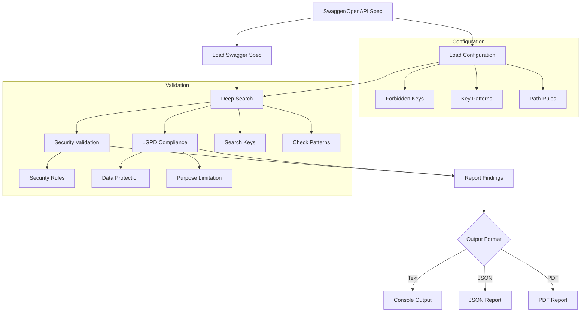

# Swagger/OpenAPI Specification Validator

[](https://github.com/geavenx/swagger-validator-v2/actions/workflows/swagger_validator.yml)
[](https://www.python.org/downloads/)
[](https://opensource.org/licenses/MIT)

A powerful tool for validating Swagger/OpenAPI specification files (YAML format) against configurable security rules and LGPD compliance requirements. This validator helps ensure your API specifications don't contain forbidden keys, sensitive information, or insecure configurations.

## Table of Contents

- [Features](#features)
- [Installation](#installation)
- [Quick Start](#quick-start)
- [Configuration](#configuration)
- [LGPD Compliance Features](#lgpd-compliance-features)
- [Usage Examples](#usage-examples)
- [Contributing](#contributing)
- [License](#license)
- [Acknowledgments](#acknowledgments)

## Features

- 🔍 Deep search through all parts of the specification
- ⚙️ Configurable forbidden keys, patterns, and path-specific rules
- 📝 Multiple output formats (text and JSON)
- 🔄 GitHub Actions integration for CI/CD
- 🛡️ LGPD (Brazilian General Data Protection Law) compliance validation
- 🚦 Clear exit codes for different scenarios:
  - `0`: Validation passes
  - `1`: Issues found
  - `2`: Other errors (file not found, parsing issues)

## How It Works



## Installation

- **Using docker (recommended):**

    ```bash
    docker run -qit --rm geaven/swagger-validator --version
    ```

- **Building from source:**

    ```bash
    git clone https://github.com/geavenx/swagger-validator-v2.git
    cd swagger-validator-v2
    pip install -e . # The use of a virtual environment is recommended
    swagger-validator --version
    ```

- **Using [uv](https://docs.astral.sh/uv/):**

    ```bash
    git clone https://github.com/geavenx/swagger-validator-v2.git
    cd swagger-validator-v2
    uv sync --locked --all-extras
    uv run swagger_validator --version
    ```

## Quick Start

1. Create a configuration file (`.forbidden_keys.yaml`):

    ```yaml
    forbidden_keys:
      - "apiKey"
      - "secretKey"
      - "password"

    forbidden_key_patterns:
      - ".*_token$"
      - "^internal_.*"
    ```

2. Run the validator:

    ```bash
    # Validate a single file
    swagger-validator path/to/your/api.yaml

    # Validate multiple files
    swagger-validator path/to/specs/*.yaml

    # Use custom config file
    swagger-validator --config custom_config.yaml path/to/your/api.yaml

    # Generate JSON report
    swagger-validator --format json path/to/your/api.yaml
    ```

    - Using docker:

    ```bash
    # Validate a single file
    docker run --rm swagger-validator:latest path/to/your/api.yaml

    # Get help
    docker run --rm swagger-validator:latest --help
    ```

## Configuration

The validator uses a YAML configuration file (`.forbidden_keys.yaml` by default) to define:

- Globally forbidden keys
- Forbidden key patterns (regex)
- Path-specific forbidden keys
- Allowed exceptions

Example configuration:

```yaml
forbidden_keys:
  - "apiKey"
  - "secretKey"
  - "password"

forbidden_key_patterns:
  - ".*_token$"
  - "^internal_.*"

forbidden_keys_at_paths:
  - path: "info.contact.email"
    key: "email"
    reason: "Contact email is sensitive."

allowed_exceptions:
  - key: "session_token"
    path_prefix: "components.schemas.Session"
```

## LGPD Compliance Features

The validator includes specific checks for LGPD compliance:

1. **Sensitive Data Detection**
   - Identifies common sensitive data patterns (CPF, CNPJ, RG, email, phone numbers)
   - Flags sensitive data in examples and descriptions
   - Detects sensitive field names in schemas and parameters

2. **Data Minimization**
   - Ensures all properties have proper descriptions
   - Flags unnecessary fields without justification
   - Validates that only required data is collected

3. **Purpose Limitation**
   - Requires clear descriptions of data processing purposes
   - Validates that endpoints have proper documentation
   - Ensures transparency in data handling

4. **Direct Identifier Protection**
   - Flags direct identifiers in API paths
   - Recommends using indirect identifiers (e.g., UUIDs)
   - Prevents exposure of sensitive identifiers

## Usage Examples

### Basic Validation

```bash
# Validate a single API specification
swagger-validator api.yaml

# Validate with custom config
swagger-validator --config security_rules.yaml api.yaml
```

### CI/CD Integration

Check the integration in [this project workflow file.](.github/workflows/swagger_validator.yml)

## Contributing

1. Fork the repository
2. Create your feature branch (`git checkout -b feature/amazing-feature`)
3. Commit your changes (`git commit -m 'Add some amazing feature'`)
4. Push to the branch (`git push origin feature/amazing-feature`)
5. Open a Pull Request

## License

This project is licensed under the MIT License - see the [LICENSE](LICENSE) file for details.

## Acknowledgments

- [OpenAPI Specification](https://swagger.io/specification/)
- [LGPD (Brazilian General Data Protection Law)](https://www.gov.br/cidadania/pt-br/acesso-a-informacao/lgpd)
